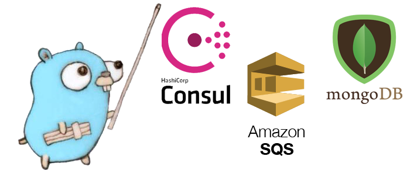
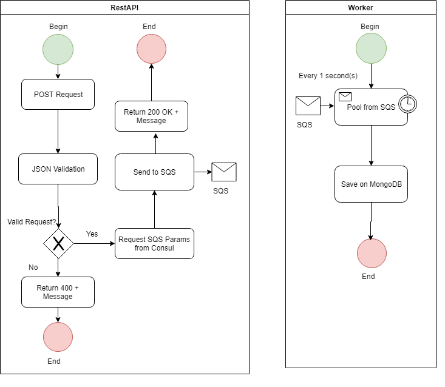

<p align="center"> 

</p>

# Desafio Maxmilhas, por Patrick Pádua

## Descrição

O desafio proposto foi: 

"Desenvolver e hospedar uma API Rest para captura de sugestões. As sugestões enviadas deverão ser enviadas para uma Queue SQS. Deverá existir uma aplicação Worker que consome as mensagens do SQS e armazena no MongoDB."

## Linguagem

Diante de vários exemplos encontrados na internet, foi escolhido um exemplo em linguagem GO.
Após bateria de testes, este exemplo apresentou boa performance, simplicidade de leitura e bons recursos, atendendo ao desafio.

## Funcionalidades

*API*

* Coleta dados de sugestões por um endpoint HTTP utilizando método POST
* Busca dados da fila SQS em um serviço do Consul
* Envia dados para fila SQS
* Busca dados de um banco MongoDB
* Exibe os dados de pesquisa por um endpoint HTTP utilizando método GET

*WORKER*

* Busca dados da fila SQS em um serviço do Consul
* Busca a cada X segundos mensagens de uma fila SQS
* Armazena mensagens em um banco de dados MongoDB

*CONSUL*

* Recebe saída de dados do Terraform como input key value
* Disponibiliza valores através de endpoints HTTP pelo método GET

*MONGODB*

* Armazena informações das sugestões cadastradas

*TERRAFORM*

* Provisiona infraestrutura necessária para execução na AWS

Fluxo da Informação

<p align="center"> 

</p>

# Instalação

Requisitos: 
Sistema operacional:  Ubuntu 18.04.03 LTS  **[clique aqui](https://ubuntu.com/download)**
Docker e Docker-compose instalado.  **[clique aqui](https://docs.docker.com/)**
Terraform instalado  **[clique aqui](https://www.terraform.io/downloads.html)**
Conta na AWS **[clique aqui](https://aws.amazon.com/pt/)**
Instalar o AWS CLI **[clique aqui](https://docs.aws.amazon.com/pt_br/cli/latest/userguide/install-linux.html)**
Configurar o AWS CLI **[clique aqui](https://docs.aws.amazon.com/pt_br/cli/latest/userguide/cli-chap-configure.html)**

Obs: Este exemplo foi desenvolvido na  zona "us-east-1" (Leste dos EUA (Norte da Virgínia)). 

1) Acessar a AWS/IAM e criar 2 usuarios (terraform e aplicacao) e conceder politicas de segurança, conforme a seguir:

**Usuário: terraform**

```
{
    "Version": "2012-10-17",
    "Statement": [
        {
            "Effect": "Allow",
            "Action": [
                "sqs:GetQueueUrl",
                "sqs:ChangeMessageVisibility",
                "sqs:SendMessageBatch",
                "sqs:UntagQueue",
                "s3:ListBucket",
                "sqs:GetQueueAttributes",
                "sqs:ListQueueTags",
                "s3:PutObject",
                "s3:GetObject",
                "sqs:TagQueue",
                "sqs:RemovePermission",
                "sqs:AddPermission",
                "sqs:DeleteMessageBatch",
                "sqs:PurgeQueue",
                "sqs:DeleteQueue",
                "sqs:CreateQueue",
                "sqs:ChangeMessageVisibilityBatch",
                "sqs:SetQueueAttributes"
            ],
            "Resource": [
                "arn:aws:s3:::Desafio-Maxmilhas-Patrick/*",
                "arn:aws:s3:::Desafio-Maxmilhas-Patrick",
                "arn:aws:sqs:*:*:Desafio-Maxmilhas-Patrick.fifo"
            ]
        },
        {
            "Effect": "Allow",
            "Action": "sqs:ListQueues",
            "Resource": "*"
        }
    ]
}
```

**Usuário: aplicacao**

```
{
    "Version": "2012-10-17",
    "Statement": [
        {
            "Effect": "Allow",
            "Action": [
                "sqs:DeleteMessage",
                "sqs:DeleteMessage",
                "sqs:SendMessage",
                "sqs:ReceiveMessage"
            ],
            "Resource": [
                "arn:aws:sqs:*:*:Desafio-Maxmilhas-Patrick.fifo"
            ]
        },
        {
            "Effect": "Allow",
            "Action": "sqs:ListQueues",
            "Resource": "*"
        }
    ]
}
```

2) Acessar o "AWS Systems Manager" > "Parameter Store" e criar 4 parêmetros do tipo string com os valores conforme a seguir:

ARG_ACCESS_KEY_ID = (Colocar o Access Key ID do usuario terraform)
ARG_SECRET_ACCESS_KEY = (Colocar o Secret Key ID do usuario terraform)
ACCESS_KEY_ID = (Colocar o Access Key ID do usuario aplicacao)
SECRET_ACCESS_KEY = (Colocar o Secret Key ID do usuario aplicacao)

3) Crie um bucket no S3 com o nome "Desafio-Maxmilhas-Patrick" com o comando abaixo:

```
aws s3 mb s3://Desafio-Maxmilhas-Patrick
```

4) Executar o comando: 

make service
```

Com o comando acima, executaremos o docker-compose fazendo o build da API, Worker e um node do Consul. Somente o serviço do Worker falhará e forçando a reinicialização do mesmo. Isso se dá pois ainda não temos a fila do SQS e GroupID definidos como Key Value no Consul. A aplicação 
verifica se o endpoint definido existe e consome o valor que o Consul provê. 

```
5) Executar o comando: 

make infra
```

Este comando iniciará o docker-compose de uma imagem do Terraform, ele executará os comandos definidos no terraform-compose.yml. Fique atento a definir as chaves com as permissões necessárias para criação das filas.
Após a execução do comando terraform apply padrão no arquivo, ele irá enviar os dados a URL da fila SQS e o GroupID das mensagens para a API do consul em endpoints definidos. Os serviços que antes não conseguiam subir, agora já fazem requisições a cada chamada. 

# 6) Testes

Nossa API estará ativa no endereço http://localhost:8080

Os endpoints existentes atualmente são:

```
GET - http://localhost:8080/v1/data
```

Este endpoint busca todas as sugestões cadastradas no banco de dados MongoDB

```
POST - http://localhost:8080/v1/data - application/json
```

Este endpoint envia as sugestões para uma fila SQS, o serviço do Worker fará o trabalho de inserção

**Template de requisição**

```
{
	"message": "Digite uma mensagem qualquer",
	"user"   : "Digite um usuario qualquer"
}
```

# Troubleshoot

Pode ser necessario rodar o comando "docker start Desafio_worker_1" caso não tenha container na porta 8080 em execução.

7) Para exclui a aplicação e limpar o ambiente, basta executar o comando abaixo.
```
make clean
```